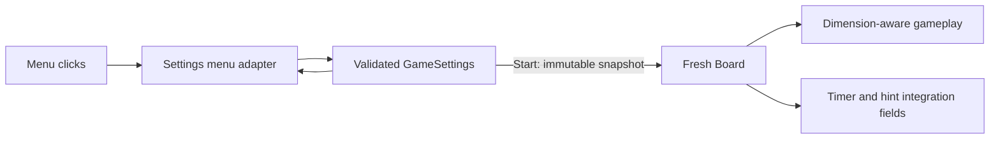

# Anthony's settings menu logic

## Scope and source requirements

`p2-documentation/hours_estimate.md` assigns **New settings menu logic** to
Anthony (estimated 3.5 hours). Jocelyn owns rendering/UML, Max owns the time
limit, and Gaven owns the AI game loop. The existing UML image lists board size,
mines, maximum hints, and time limit. The README and P1 meeting log describe the
inherited fixed 10x10 game. The supplied assignment screenshots require a custom
feature, documentation, and a separate development branch, but give no setting
ranges. No additional requirements or branches were present in the cloned repo.

## Chosen settings

| Setting | Values | Default |
| --- | --- | --- |
| Square board size | 8, 10, 12 | 10 |
| Mines | 1 through min(99, board size squared minus 9) | 20 |
| Maximum hints | 0–10 | 0 |
| Time limit | Off, then 1–30 minutes in one-minute steps | Off |

Nine cells are reserved for first-click safety even when the first click is in
the center. The mine counter uses two digits. Shrinking the board clamps mines
to the new maximum. Buttons stop at bounds rather than wrapping. Invalid direct
construction raises `ValueError`. Time is stored in seconds; zero means unlimited.

## Integration

- `settings.py`: immutable `GameSettings`, validation, adjustment, board creation.
- `settings_menu.py`: small working view/event adapter; Jocelyn can replace its
  drawing without changing the model. Only left clicks activate controls.
- `gui.py`: retain menu choices, create a fresh board on Start, resize the display,
  and restore the menu display after a finished game. Uses event click positions.
- `defs.py`: `Board(mines)` remains compatible with the default 10x10 size;
  `Board(mines, size)` accepts supported sizes. Each board exposes `rows`, `cols`,
  `settings`, `max_hints`, and `time_limit_seconds`.
- `backend.py`: use board dimensions for placement, neighbors, reveal, and win
  checks. Sample mine positions without retries. A flagged first click does not
  initialize a game. First-click initialization is now owned by the backend.
- `ai.py`: adapt existing loops to board dimensions and add missing imports.
  Solver algorithms and game-loop integration remain the assigned teammates' work.

Hint count and time-limit **configuration** are implemented and passed to the
board. This change does not implement hint actions or timer expiration. Max's
timer should consume `board.time_limit_seconds`; a hint feature should consume
`board.max_hints`. Neither feature is currently present in the upstream game.
Settings persist for the running application only; there is no disk persistence.



## Run and verify

Use Python 3.9 or newer with a compatible Pygame wheel (tested with Python 3.9.6).

```sh
python3 -m pip install -r requirements.txt
python3 gui.py
python3 -m unittest discover -s tests -v
```

Automated checks cover invalid input, bounds, shrinking, independent new games,
first-click safety and wins across all sizes, menu clicks, drawing, tile hit
boxes, and existing easy/medium AI compatibility. The GUI checks run with SDL's
dummy display. Manual demo: change every setting, start each board size, finish a
game, return to the menu, and confirm that choices are retained.

No actual person-hours were estimated or fabricated here; record your own
coding, review, testing, and meeting time separately.
